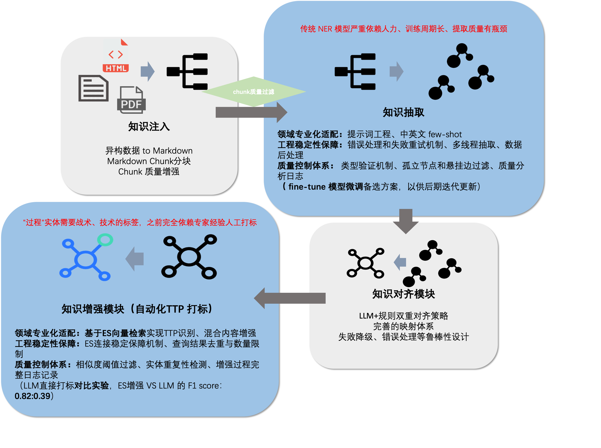

# LLM-KG-FineTuner

**从非结构化文档到知识图谱的端到端自动化系统**

LLM-KG-FineTuner 能够将 PDF/HTML 文档自动转换为结构化知识图谱，支持实体抽取、关系识别、图谱增强和模型微调。适用于威胁情报分析、技术文档结构化、知识管理等场景。




---

## ⚡ 5分钟快速开始

### 1. 安装依赖

```bash
pip install -r requirements.txt
```

### 1.5. 下载 PDF 解析模型（仅 PDF 处理需要）

如果你需要处理 PDF 文件，需要下载 Docling 模型：

```bash
# 方法 1：使用提供的脚本（推荐）
python docling_download.py

# 方法 2：手动下载
# 模型将下载到 ./docling-models 目录（约 1-2GB）
```

> 💡 **说明**：
> - 模型使用 ModelScope 下载（国内更快）
> - 如果只处理 HTML 文件，可以跳过此步骤
> - 模型下载一次后会缓存在本地，无需重复下载

> ⚠️ **如果下载失败**：
> ```bash
> # 安装 ModelScope
> pip install modelscope
>
> # 如果 PyTorch 有问题，先安装 CPU 版本
> pip install torch torchvision torchaudio --index-url https://download.pytorch.org/whl/cpu
> ```

### 2. 配置 API Key

```bash
cp config.minimal.example.json config.json
```

然后编辑 `config.json`，填写你的 LLM API Key：

```json
{
  "openai": {
    "api_key": "你的API密钥",
    "base_url": "https://api.openai.com/v1",
    "model": "gpt-4"
  }
}
```

> 💡 **支持任何 OpenAI 兼容 API**：OpenAI、Azure、阿里云通义千问、Ollama 等

### 3. 运行 Demo

```bash
# 基础运行（使用配置文件中的默认标题）
python main.py --input test_samples/apt-report.pdf --output demo_output

# 指定文档标题（推荐，用于提取 Report 实体）
python main.py --input test_samples/apt-report.pdf --output demo_output --title "Your Report Title"
```

✅ **完成！** 处理结果将保存在 `demo_output/` 目录。

---

## 🎯 核心能力

| 能力 | 说明 | 必需依赖 |
|------|------|---------|
| 📄 **文档解析** | PDF/HTML → Markdown（基于 Docling） | 无 |
| 🔍 **智能分块** | 基于语义连贯性的动态分块 | LLM API |
| 🧠 **知识抽取** | 实体 + 关系联合抽取 | LLM API |
| 🔗 **实体对齐** | 跨 chunk 实体消歧与合并 | 无（默认开启） |
| 🚀 **图谱增强** | Elasticsearch + 外部知识注入 | ES + Embedding API |
| 🎓 **模型微调** | 基于抽取数据微调 LLM | GPU + 训练数据 |

---

## 📖 运行模式

### 模式 A：基础模式（推荐新用户）

**适用场景**：快速体验、验证效果、小规模文档处理

**特点**：
- ✅ 仅需 LLM API Key
- ✅ 不需要 Elasticsearch
- ✅ 不需要 GPU
- ✅ 完成完整的文档→图谱流程

**配置**：使用 `config.minimal.example.json`

**运行**：
```bash
python main.py --input your_document.pdf
```

---

### 模式 B：增强模式（生产环境）

**适用场景**：大规模知识图谱构建、需要外部知识增强

**特点**：
- ✅ 集成 Elasticsearch 进行知识检索
- ✅ 使用 Embedding 模型进行语义匹配
- ✅ 自动注入外部 TTP 知识

**配置**：
1. 复制完整配置模板
   ```bash
   cp config.example.json config.json
   ```

2. 填写 Elasticsearch 配置
   ```json
   {
     "graph_enhancer": {
       "enable": true,
       "elasticsearch": {
         "hosts": ["http://localhost:9200"],
         "auth": ["elastic", "your_password"]
       }
     }
   }
   ```

3. 启动 Elasticsearch（如果尚未运行）
   ```bash
   docker run -d -p 9200:9200 -e "discovery.type=single-node" elasticsearch:8.11.0
   ```

**运行**：
```bash
python main.py --input your_document.pdf --mode enhanced
```

---

## 🛠️ 环境安装

### 系统要求

- Python 3.9+
- 4GB+ RAM（基础模式）
- 8GB+ RAM（增强模式）

### 安装步骤

```bash
# 1. 克隆仓库
git clone https://github.com/your-org/LLM-KG-FineTuner.git
cd LLM-KG-FineTuner

# 2. 创建虚拟环境（推荐）
python -m venv venv
source venv/bin/activate  # Linux/Mac
# 或
venv\Scripts\activate     # Windows

# 3. 安装依赖
pip install -r requirements.txt

# 4. 下载 Docling 模型（PDF 解析必需）
python docling_download.py
```

---

## ⚙️ 配置文件说明

### 必填项（基础模式）

```json
{
  "openai": {
    "api_key": "YOUR_API_KEY_HERE",      // ← 必填：你的 LLM API Key
    "base_url": "YOUR_BASE_URL_HERE",    // ← 必填：API 端点地址
    "model": "gpt-4"                     // ← 必填：模型名称
  }
}
```

### 可选项（增强模式）

| 配置项 | 默认值 | 说明 |
|--------|--------|------|
| `graph_enhancer.enable` | `false` | 是否启用图谱增强 |
| `graph_enhancer.elasticsearch.hosts` | `["http://localhost:9200"]` | ES 地址 |
| `graph_enhancer.elasticsearch.auth` | `null` | ES 认证信息 `[用户名, 密码]` |
| `quality_filter.enable_quality_filter` | `false` | 是否启用质量过滤 |

### 完整配置模板

- **最小配置**：`config.minimal.example.json`（基础模式）
- **完整配置**：`config.example.json`（所有功能）

---

## 📂 示例输入与输出

### 输入文件

```
test_samples/
└── apt-report.pdf          # 示例 APT 威胁情报报告
```

### 输出文件

运行后会在输出目录生成以下文件：

```
demo_output/
├── 01_raw_markdown.md              # 原始 Markdown
├── 02_processed_markdown.md        # 处理后 Markdown
├── 03_selected_chunks.json         # 选中的文本块
├── 04_raw_graph_data.json          # 原始图数据
├── 05_knowledge_graph_full.json    # 完整知识图谱
├── 06_knowledge_graph_simple.json  # 简化版知识图谱
├── 07_enhanced_knowledge_graph.json # 增强后知识图谱（如启用）
├── 08_enhancement_stats.json       # 增强统计
└── 09_final_results.json           # 最终结果
```

---

## ❓ 常见问题 FAQ

### Q1: 支持哪些 LLM API？

A: 支持任何 **OpenAI 兼容 API**，包括：
- OpenAI (`https://api.openai.com/v1`)
- 阿里云通义千问 (`https://dashscope.aliyuncs.com/compatible-mode/v1`)
- Azure OpenAI
- Ollama 本地部署 (`http://localhost:11434/v1`)
- 其他兼容 OpenAI 接口的服务

### Q2: 没有 Elasticsearch 能运行吗？

A: **完全可以！** 基础模式不需要 Elasticsearch。只有在需要图谱增强功能时才需要配置 ES。

### Q3: 报错 "API key not configured"

A: 请检查 `config.json` 中的 `openai.api_key` 是否已填写。不要使用示例文件中的占位符。

### Q4: 报错 "Elasticsearch connection failed"

A: 这不影响基础模式运行。如果想使用增强功能：
1. 检查 ES 是否运行：`curl http://localhost:9200`
2. 检查 `config.json` 中的 `graph_enhancer.elasticsearch.hosts` 是否正确
3. 如果不需要增强功能，设置 `"graph_enhancer.enable": false`

### Q5: PDF 解析失败

A: 请确保已下载 Docling 模型：
```bash
python docling_download.py
```

### Q6: 如何自定义实体和关系类型？

A: 编辑 `config.json` 中的 `knowledge_extractor.entity_types` 和 `relationship_types`。

### Q7: 可以在 CPU 上运行吗？

A: **可以！** 基础模式完全在 CPU 上运行。只有模型微调需要 GPU。

---

## 🔒 安全说明

- ⚠️ **绝对不要** 将真实的 API Key 提交到 Git 仓库
- ⚠️ `config.json` 已在 `.gitignore` 中，不会被意外提交
- ✅ 所有密钥必须由用户自行填写
- ✅ 示例配置文件使用占位符（如 `YOUR_API_KEY_HERE`）

---

## 📚 进阶功能

### 模型微调

参见 `fine_tune_demo/README.md` 了解如何使用抽取数据微调 LLM。

### Elasticsearch 数据导入

如果你需要启用图谱增强功能，需要先将 TTP 数据导入 Elasticsearch：

**1. 准备数据**

按照 `es_handle_data/example_ttp_data.csv` 的格式准备你的 TTP 数据：

```csv
tactics,techniques,procedure
Initial Access,T1566.001,Spearphishing attachment with malicious PDF
Execution,T1059.001,Command shell execution through PowerShell
```

**2. 运行导入脚本**

```bash
# 测试 ES 连接
python es_handle_data/test_es_connection.py

# 导入数据（修改 populate_ttp_index.py 中的 CSV 路径）
python es_handle_data/populate_ttp_index.py
```

**3. 配置并启用增强模式**

在 `config.json` 中：
```json
{
  "graph_enhancer": {
    "enable": true,
    "elasticsearch": {
      "hosts": ["http://localhost:9200"],
      "index_name": "test_ttp_embedding_index"
    }
  }
}
```

> 💡 **提示**：
> - 确保 Elasticsearch 服务已启动
> - 确保已配置 Embedding API（如 text-embedding-v2）
> - 参考 `es_handle_data/` 目录中的完整脚本


## 📄 许可证

本项目采用 MIT 许可证。详见 [LICENSE](LICENSE) 文件。

---

## 🤝 贡献

欢迎提交 Issue 和 Pull Request！

---

**快速开始** | [5分钟快速开始](#-5分钟快速开始) | **问题反馈** | [GitHub Issues](https://github.com/your-org/LLM-KG-FineTuner/issues)
